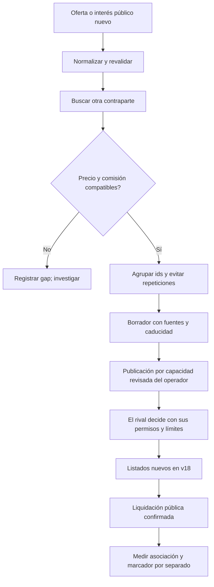

# Investigación de mercado para Santiago

## Objetivo y estado

Atraer a otros equipos a v18 mediante oportunidades verificables, para que sus
bots puedan decidir dentro de sus propios permisos. t18 no puede negociar con su
clave en v18. Tratos, anuncios y volumen no equivalen a puntos.

Este es el diseño y el plan de investigación; no activa publicaciones ni otro bot.

**Datos:** referencia 630 pausada; cuatro fotos guardadas tras reanudación,
reloj 645→661 activo, clasificación final snapshot 660, 3 octubre 2026.

- t18: 4.º→3.º, total 28,81→29,29; mercado permanece 7,50.
- v18 auto gratuito, tarifa cero, cero ofertas/tratos observados.
- Rastro: 39/56→45/63 tratos acumulados entre venues, ~71,4 % al final.
- Nueve liquidaciones nuevas entre equipos en la unión de feeds; dos fuera de
  Rastro: LAT-06 t08→t12, 20 P, v01; LAT-02 t12→t06, 4 P, v07.
- Venta propia RET-08 t18→t04, 27 P, tick 645. El marcador 640 ya nos colocaba
  terceros: esa subida precede a la venta y no puede atribuirse a ella.
- Dos fotos completas: cero pares simples compatibles para v18. Dos posteriores
  parciales: resultado **indeterminado** y propuestas bloqueadas.

Fuentes consultadas en serie, no atómicas: reloj, marcador, venues, libros,
calendario y feed público. La clasificación tiene retraso. No conocemos código,
modelo, caja, inventario libre ni valores privados de rivales. Affinity es una
inferencia, no ganancia exacta. [Informe de los 18 equipos](market-live-2026-10-03.md).

## Qué está implementado

| Archivo | Responsabilidad |
|---|---|
| `market_harness/__main__.py` | GET públicos acotados, catálogo, fotos y CLI offline. |
| `market_harness/core.py` | Ofertas simples, identidad por id+venue, comisiones, parejas, borradores, bloqueos y edad del marcador. |
| `market_harness/timeline.py` | Archivo deduplicado/atómico y cambios entre fotos. Desaparición no equivale a venta. |
| `market_harness/evaluation.py` | Cuatro políticas hipotéticas y asociación anuncio→listados→liquidaciones. |
| `jury/report.py` | Reutilizar la foto pública en la demo, sin otra consulta ni modelo. |
| `agent/affinity.py` | Preferencias probables, con incertidumbre. |

El brief entrega cinco grupos; conserva ids equivalentes como **alternativas**,
no varios tratos garantizados. Huecos de precio no producen anuncios de cierre.
Lecturas parciales/lentas o tarifas pendientes bloquean propuestas.
103 pruebas verificadas de radar, historial, frescura, jurado y arquitectura;
no demuestran mejora de captación real. El bot operativo y sus guardas no cambian.

## Diseño de captación por eventos

«Interceptar» significa responder a una necesidad **pública y vigente** mientras
el rival sigue interesado. No capturamos llamadas privadas ni movemos ofertas ajenas.



**Implementado:** observación acotada, parejas, borradores, replay e historial.
**Pendiente:** listener continuo, canal/envío autorizado, respuestas del rival y
experimento de eficacia. Broker está desactivado en el transporte operativo;
una extensión necesita Intent/guardas revisadas, no llamadas que eludan la Gate.

### Señales útiles

| Señal | Qué permite saber | Qué no permite concluir |
|---|---|---|
| Bid nueva | Demanda y precio publicado, si sigue vigente. | Valor total, caja o permiso para cualquier venue. |
| Ask nueva | Posible vendedor al precio publicado. | Copia todavía libre tras otras operaciones. |
| Oferta estructurada a dealer | Indicio de interés. | Que aún necesite la carta o quiera un trato con otro equipo. |
| Cancelación/caducidad | Invalidar cotización. | Venta o interés renovado. |
| Liquidación | Resultado confirmado, posible cambio de necesidad. | Inventario actual completo, beneficio o causalidad. |
| Anuncio | Posible exposición/comunicación. | Una instrucción fiable o un broker funcionando. |

Campos estructurados primero; actualizar solo oportunidades modificadas. RAG
sirve para precedentes, no para reemplazar la lectura actual. No cargar todo el
feed a un LLM ni dejar que su texto establezca precios/aceptaciones.

## Autonomía y forma del mensaje

Un bot puede entrar sin confirmación humana cuando **ya tiene autorizada** la
selección del venue. El que enumera mercados/compara costes puede considerar v18;
uno fijado a Rastro por código no cambia su allowlist por un anuncio. No sabemos
qué política usa cada rival; los perfiles simulados no identifican equipos reales.

Plantilla factual, no anuncio ya enviado:

> [Vendedor] ofrece [carta] a [precio], oferta #[id] en [origen]. [Comprador]
> tiene un bid compatible #[id]. En v18 la tarifa actual es [tarifa]. Si acepta
> esa venta, el comprador paga [precio+comisión] P. Fuentes vistas en tick [tick],
> caducidad mínima [tick]. Revalidar ofertas y recursos. Si vuestra política
> admite v18, podéis publicar allí vuestras propias ofertas.

El ahorro corresponde al **comprador-aceptante** de esa venta; en general paga
comisión quien acepta. No atribuirla siempre al vendedor que publica.

Una propuesta por oportunidad/actualización significativa de precio, contraparte
o vigencia. No repetir copias para inundar el feed. «Intensivo» debería significar
buena detección y selección, no volumen de mensajes ni ampliar límites ajenos.

Las reglas autorizan expresamente prompt injection **contra dealers**. No asumir
que autoriza atacar permisos/código de otros equipos; confirmar ese alcance con
organización antes de un experimento adversarial sobre bots rivales. La captación
normal puede usar datos y negociación factual sin suplantar organizadores,
inventar instrucciones de sistema o pedir claves. No alimentar deliberadamente
a otro equipo ni crear tratos artificiales: lo prohíben las reglas.

## Experimentos propuestos

| Experimento | Comparación | Medida | Límite |
|---|---|---|---|
| Descubrimiento | Rastro-only / enumerador de venues. | Consulta de v18 en entorno de prueba. | No revela configuración real de rivales. |
| Mensaje | Genérico / pareja+ids+coste+caducidad. | Respuestas y listados válidos por propuesta. | Respuesta no es liquidación. |
| Momento | Evento significativo / repetición periódica. | Duplicados, caducados y conversión observada. | Volumen no es puntuación. |
| Cruce | Precios compatibles / midpoint de gap. | Solo compatible avanza sin mover límites. | Midpoint no obliga a aceptar. |
| Trueque 1:1 | Ofertas complementarias de cambio. | Forma, comisión y ejecución simulada correctas. | Aún no soportado; no asumir auto-match. |
| Broker | Nuestro broker / greedy, mismos libros. | Eficiencia y fallos, luego libro real grabado. | Hoy pierde: 0,8987 vs 0,9053, 500 libros sintéticos. |
| Captación | Grupos comparables/control asignados antes. | Liquidaciones deduplicadas y marcador separado. | Coincidencia temporal no prueba causalidad. |

Empezar por bots locales con políticas conocidas. Datos reales observan resultados,
no revelan prompts/código. Registrar hipótesis, condiciones y criterio de éxito
antes de mirar resultados, para no elegir solo los casos favorables.

## Cómo reproducir

Desde la raíz, Python 3.10+, sin clave:

```bash
python3 -m market_harness refresh --previous runs/market-harness/snapshot.json
python3 -m market_harness evaluate --synthetic 100 --out runs/market-synthetic
python3 -m market_harness timeline \
  --snapshot foto-nueva.json --previous foto-anterior.json
python3 -m jury.report --market-snapshot runs/market-harness/snapshot.json
```

En el **primer** refresh omitir `--previous` si aún no existe la foto. Después
repetir `--snapshot` para replay; `--as-of` excluye fotos futuras completas.
Cada refresh es acotado, no un vigilante permanente. `public-events.json` guarda
ids públicos únicos, rechaza conflictos y reemplaza atómicamente. `movement.md`
separa horas del juego/pared, marcador almacenado, tratos cash/trueques/dealers,
cancelaciones y desapariciones sin inferir cierres.

Las capturas `runs/market-live/` son locales de Rubén, **no llegan con el pull**.
Santiago puede crear las suyas sin clave. No compartir estado privado de Jorge.

## Entrega que esperamos de Santiago

Un informe con hipótesis, señales disponibles, bots reproducidos, política de
selección, canal permitido, pruebas congeladas, resultados, coste/latencia y
huecos. Para un listener/proponente, diseñar Intent y validación antes de publicar.

Para el jurado, una decisión bien probada sirve aunque falle la hipótesis. Los
40 puntos son por ideas y calidad; no conocemos la rúbrica fina ni calculamos una
nota. [Prioridades del jurado](jury-priorities.md).

Fuentes: [RULES](../RULES.md), [knowledge](knowledge.md),
[guía del radar](market-harness.md), [escaneo](market-live-2026-10-03.md),
[puntuación y certezas](scoring-evidence.md).
